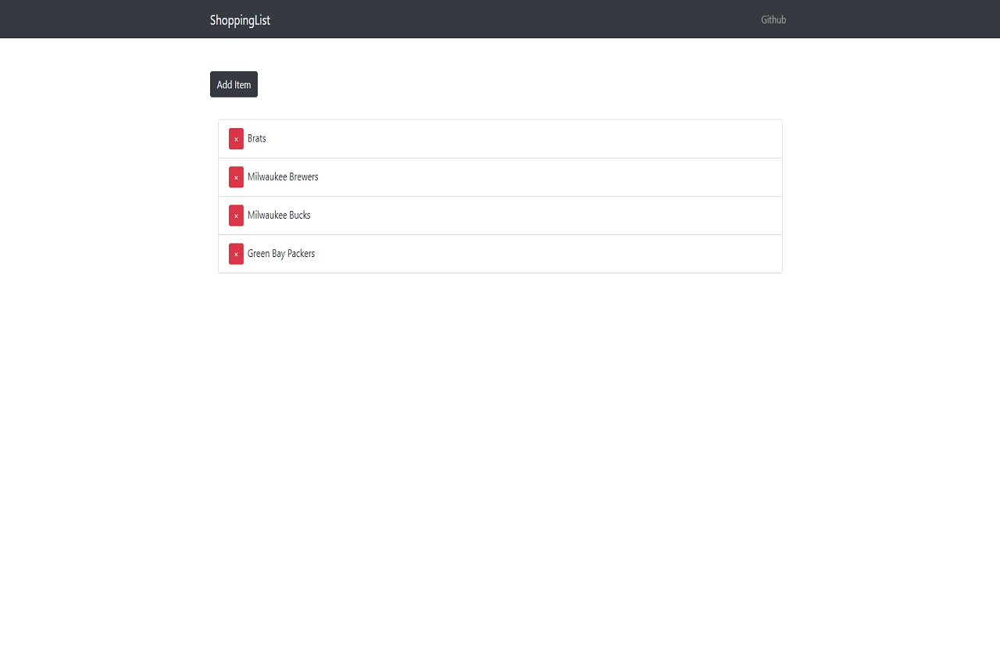

# Shopping List
This is a full-stack CRUD app which is able to send, receive, update, and delete data created in the UI and then
pushed to the database. It is able to display items you've created in the UI and you can remove them by clicking the red 'X'
after you no longer need it.

# Motivation
This project challenged me to learn new technologies which included: NodeJS, Express and MongoDB. I enjoyed learning the MERN
stack and I would definitely make apps utilizing that stack in the future.

# Screenshots

# Tech/framework used

**Built with**  

* [React](https://github.com/facebook/react)
# Features
The app is able to save the items you have put onto your shopping list.

# Code Example
    const express = require('express');
    const router = express.Router();

    // Item model
    const Item = require('../../models/Item');

    // @route  GET api/items
    // @desc   Get All Items
    // @access Public

    router.get('/', (req, res) => {
        Item.find()
            .sort({ date: -1 })
            .then(items => res.json(items))
    });

# Installation
npm install MERN_Shopping_List

# License
MIT © Matt Habeck
